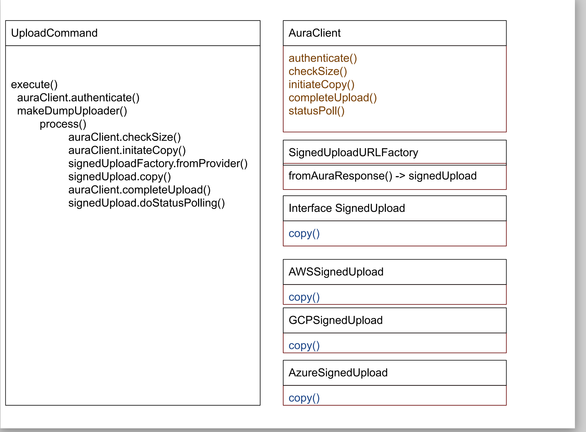

## Command: neo4j-admin database upload

### Overview

This command is part of neo4j-admin and will upload a dump to Aura. 
It aims to be as basic as possible and let Aura's server side tell it what to do.
It will select the correct cloud provider based on the response it gets back from Aura as per the diagram below:

Note the diagram is missing lots of details but aims to show the general flow of the code.

This structure allows us to keep adding new cloud providers without having to change much of the rest of the code.

Once the upload is complete we poll to verify Aura has successfully imported the dump.
